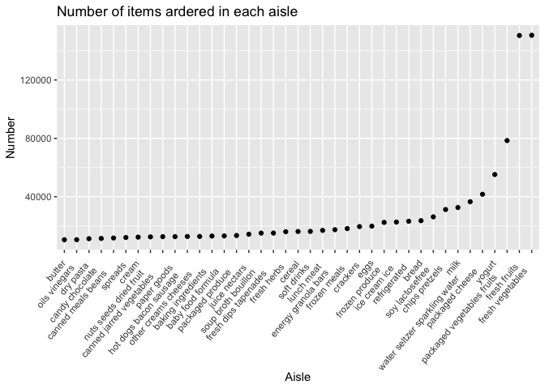

p8105_hw3_jl5788
================
Jie Liu
10/18/2021

# Problem 1

``` r
data("instacart")
instacart =
  instacart %>% 
  as_tibble(instacart)
```

#### General Description of Dataset

This dataset contains 1384617 rows and 15 columns, with each row
representing a product from an instacart order. Total 15 Variables
include identifier for order, product, user and aisle. The dataset
includes name-specific variables like the name of the
department(e.g. daily eggs, produce), aisle(e.g. yogurt, fresh
vegetables) and product(e.g. Bulgarian Yogurt, Asparagus). Besides,
there are some order-level variables, describing the order sequence
number for one user, the day of the week on which the order was placed
and the hour of the day on which the order was placed.The dataset also
contains a variable (named “reordered”) describing that whether the
product has been ordered by this user in the past.

In total, there are 39123 kind of products from 131209 orders by 131209
users.

#### Below is a 134 x 2 tibble showing the number of items ordered from aisle and sorting in descending order

There are 134 aisles, with fresh vegetables ranking No.1 of the items
ordered.

``` r
instacart %>% 
  count(aisle) %>% 
  arrange(desc(n))
```

    ## # A tibble: 134 × 2
    ##    aisle                              n
    ##    <chr>                          <int>
    ##  1 fresh vegetables              150609
    ##  2 fresh fruits                  150473
    ##  3 packaged vegetables fruits     78493
    ##  4 yogurt                         55240
    ##  5 packaged cheese                41699
    ##  6 water seltzer sparkling water  36617
    ##  7 milk                           32644
    ##  8 chips pretzels                 31269
    ##  9 soy lactosefree                26240
    ## 10 bread                          23635
    ## # … with 124 more rows

#### Below is a plot that shows the number of items ordered in each aisle(items whose number is \<=10000 are excluded)

``` r
instacart %>% 
  count(aisle) %>% 
  filter(n>10000) %>% 
  mutate(aisle=fct_reorder(aisle,n)) %>% 
  arrange(desc(n)) %>% 
  ggplot(aes(x = aisle, y = n)) + geom_point() +labs(x = "Aisle",y= "Number",title = "Number of items ardered in each aisle") + theme(axis.text.x = element_text(angle = 50, hjust = 1.2))
```

<!-- -->

#### Below is a table showing the three most poplular items in each of the aisles “baking ingredients”, “dog food care”, and “packaged vegetables fruits”.
