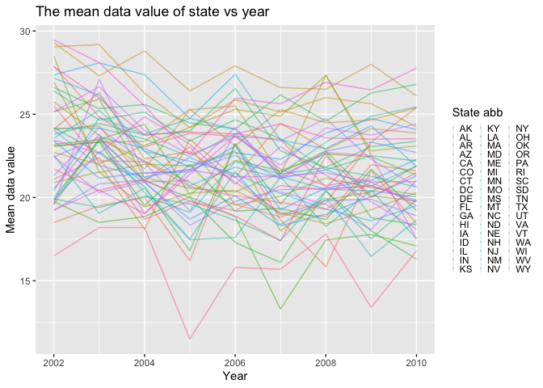
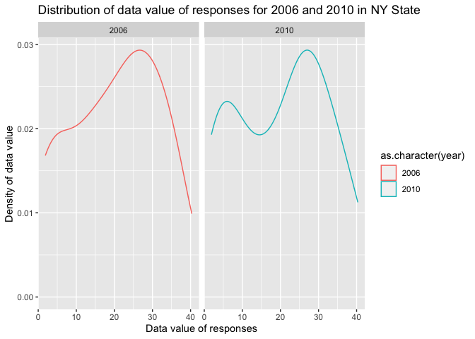
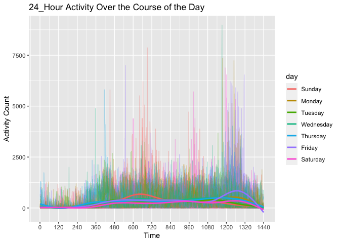

p8105_hw3_jl5788
================
Jie Liu
10/18/2021

# Problem 1

``` r
data("instacart")
instacart =
  instacart %>% 
  as_tibble(instacart)
```

#### General Description of Dataset

This dataset contains 1384617 rows and 15 columns, with each row
representing a product from an instacart order. Total 15 Variables
include identifier for order, product, user and aisle. The dataset
includes name-specific variables like the name of the
department(e.g. daily eggs, produce), aisle(e.g. yogurt, fresh
vegetables) and product(e.g. Bulgarian Yogurt, Asparagus). Besides,
there are some order-level variables, describing the order sequence
number for one user, the day of the week on which the order was placed
and the hour of the day on which the order was placed.The dataset also
contains a variable (named “reordered”) describing that whether the
product has been ordered by this user in the past.

In total, there are 39123 kind of products from 131209 orders by 131209
users.

#### Below is a 134 x 2 tibble showing the number of items ordered from aisle and sorting in descending order

There are 134 aisles, with fresh vegetables ranking No.1 of the items
ordered.

``` r
instacart %>% 
  count(aisle) %>% 
  arrange(desc(n))
```

    ## # A tibble: 134 × 2
    ##    aisle                              n
    ##    <chr>                          <int>
    ##  1 fresh vegetables              150609
    ##  2 fresh fruits                  150473
    ##  3 packaged vegetables fruits     78493
    ##  4 yogurt                         55240
    ##  5 packaged cheese                41699
    ##  6 water seltzer sparkling water  36617
    ##  7 milk                           32644
    ##  8 chips pretzels                 31269
    ##  9 soy lactosefree                26240
    ## 10 bread                          23635
    ## # … with 124 more rows

#### Below is a plot that shows the number of items ordered in each aisle(items whose number is \<=10000 are excluded)

``` r
instacart %>% 
  count(aisle) %>% 
  filter(n>10000) %>% 
  mutate(aisle=fct_reorder(aisle,n)) %>% 
  arrange(desc(n)) %>% 
  ggplot(aes(x = aisle, y = n)) + geom_point() +labs(x = "Aisle",y= "Number",title = "Number of items ardered in each aisle") + theme(axis.text.x = element_text(angle = 50, hjust = 1.2))
```

<!-- -->

#### Below is a table showing the three most poplular items in each of the aisles “baking ingredients”, “dog food care”, and “packaged vegetables fruits”.

``` r
instacart %>% 
  filter(aisle %in% c( "baking ingredients","dog food care", "packaged vegetables fruits")) %>% 
  group_by(aisle) %>% 
  select(aisle,everything()) %>% 
  count(product_name) %>% 
  mutate(rank = min_rank(desc(n))) %>% 
  filter( rank<4 ) %>% 
  arrange(desc(n)) %>% 
  knitr::kable()
```

| aisle                      | product_name                                  |    n | rank |
|:---------------------------|:----------------------------------------------|-----:|-----:|
| packaged vegetables fruits | Organic Baby Spinach                          | 9784 |    1 |
| packaged vegetables fruits | Organic Raspberries                           | 5546 |    2 |
| packaged vegetables fruits | Organic Blueberries                           | 4966 |    3 |
| baking ingredients         | Light Brown Sugar                             |  499 |    1 |
| baking ingredients         | Pure Baking Soda                              |  387 |    2 |
| baking ingredients         | Cane Sugar                                    |  336 |    3 |
| dog food care              | Snack Sticks Chicken & Rice Recipe Dog Treats |   30 |    1 |
| dog food care              | Organix Chicken & Brown Rice Recipe           |   28 |    2 |
| dog food care              | Small Dog Biscuits                            |   26 |    3 |

#### A table showing the mean hour of the day at which Pink Lady Apples and Coffee Ice Cream are ordered on each day of the week

``` r
instacart %>% 
  filter(product_name %in% c("Pink Lady Apples", "Coffee Ice Cream")) %>% 
  group_by(product_name,order_dow) %>% 
  summarize(mean_hour = mean(order_hour_of_day)) %>% 
  spread(key=order_dow, value= mean_hour) %>% 
  knitr::kable(digits = 2)
```

    ## `summarise()` has grouped output by 'product_name'. You can override using the `.groups` argument.

| product_name     |     0 |     1 |     2 |     3 |     4 |     5 |     6 |
|:-----------------|------:|------:|------:|------:|------:|------:|------:|
| Coffee Ice Cream | 13.77 | 14.32 | 15.38 | 15.32 | 15.22 | 12.26 | 13.83 |
| Pink Lady Apples | 13.44 | 11.36 | 11.70 | 14.25 | 11.55 | 12.78 | 11.94 |

# Problem 2

#### Data cleaning

``` r
data("brfss_smart2010")
brfss =
  brfss_smart2010 %>% 
  as_tibble(brfss_smart2010) %>% 
  janitor::clean_names() %>% 
  filter(topic %in% c("Overall Health")) %>% 
  filter(response %in% c("Excellent", "Poor","Very good", "Good","Fair")) %>% 
  mutate(response = fct_relevel(response, c("Poor", "Fair", "Good", "Very good", "Excellent")))
```

#### In 2002, which states were observed at 7 or more locations? What about in 2010?

According to filtered data below,in 2002, there are 6 states observed at
7 or more locations, which are CT, FL, MA, NC, NJ, PA. In 2010, there
are 14 states observed at 7 or more locations, which are CA, CO, FL, MA,
MD, NC, NE, NJ, NY, OH.

``` r
location_2002 =
  brfss %>% 
  filter(year == 2002) %>% 
  group_by(locationabbr,locationdesc) %>% 
  summarize(n_obs =n()) %>% 
  summarize(n_obs =n()) %>% 
  filter(n_obs >=7)
```

    ## `summarise()` has grouped output by 'locationabbr'. You can override using the `.groups` argument.

``` r
location_2010 =
  brfss %>% 
  filter(year == 2010) %>% 
  group_by(locationabbr,locationdesc) %>% 
  summarize(n_obs =n()) %>% 
  summarize(n_obs =n()) %>% 
  filter(n_obs >=7)
```

    ## `summarise()` has grouped output by 'locationabbr'. You can override using the `.groups` argument.

#### Construct a dataset

``` r
Excellent_dataset =
  brfss %>% 
  filter(response== "Excellent") %>% 
  group_by(locationabbr,locationdesc) %>% 
  mutate(mean=mean(data_value)) %>% 
  select(response,year,locationabbr,locationdesc,mean) 

excell_df =
  brfss %>% 
  filter(response == "Excellent") %>% 
  select(year, locationabbr, data_value) %>% 
  group_by(year, locationabbr) %>% 
  summarize(mean = mean(data_value))
```

    ## `summarise()` has grouped output by 'year'. You can override using the `.groups` argument.

``` r
excell_df %>% 
  group_by(locationabbr) %>% 
  ggplot(aes(x = year, y = mean, color = locationabbr)) +
  geom_line(alpha = 0.5) +
  labs(
    title = "The mean data value of state vs year",
    y = "Mean data value", 
    x = "Year",
  ) +
  scale_colour_hue("State abb") +
  theme(legend.key.size = unit(0.02,'cm')) +
  theme(legend.key.width = unit(0.05,'cm'))
```

    ## Warning: Removed 3 row(s) containing missing values (geom_path).

<!-- -->

#### Make a two-panel plot showing

``` r
brfss %>%
  filter(locationabbr == "NY", year %in% c(2006, 2010)) %>%
  ggplot(aes(x = data_value, color = as.character(year))) +
  geom_density() +
  facet_grid(. ~ year) + 
  labs(title = "Distribution of data value of responses for 2006 and 2010 in NY State",
       x = "Data value of responses",
       y = "Density of data value")
```

<!-- -->

# Problem 3

#### Load,tidy,and otherwise wrangle the data

``` r
accelerometer_df=
  read_csv("data/accel_data.csv") %>% 
  janitor::clean_names() %>% 
  pivot_longer(
    activity_1:activity_1440,
    names_to = "minute",
    names_prefix = "activity_",
    values_to = "activity_count") %>% 
  mutate(minute=as.numeric(minute),day=factor(day),day=fct_relevel(day,"Sunday","Monday","Tuesday","Wednesday","Thursday","Friday","Saturday"),weekend=as.numeric(day%in% c("Saturday","Sunday")),weekend=recode(weekend,'1'="weekend",'0'="weekday")) 
```

    ## Rows: 35 Columns: 1443

    ## ── Column specification ────────────────────────────────────────────────────────
    ## Delimiter: ","
    ## chr    (1): day
    ## dbl (1442): week, day_id, activity.1, activity.2, activity.3, activity.4, ac...

    ## 
    ## ℹ Use `spec()` to retrieve the full column specification for this data.
    ## ℹ Specify the column types or set `show_col_types = FALSE` to quiet this message.

``` r
accelerometer_df=
  read_csv("data/accel_data.csv") %>% 
  janitor::clean_names() %>% 
  pivot_longer(
    activity_1:activity_1440,
    names_to = "minute",
    names_prefix = "activity_",
    values_to = "activity_count") %>% 
  mutate(minute=as.numeric(minute),day=factor(day),day=fct_relevel(day,"Sunday","Monday","Tuesday","Wednesday","Thursday","Friday","Saturday"),weekend=as.numeric(day))
```

    ## Rows: 35 Columns: 1443

    ## ── Column specification ────────────────────────────────────────────────────────
    ## Delimiter: ","
    ## chr    (1): day
    ## dbl (1442): week, day_id, activity.1, activity.2, activity.3, activity.4, ac...

    ## 
    ## ℹ Use `spec()` to retrieve the full column specification for this data.
    ## ℹ Specify the column types or set `show_col_types = FALSE` to quiet this message.

This cleaned dataset concerning accelerometer data collected on a 63
year-old male with BMI 25 has 50400 rows and 6 columns.Altogether,it has
5 variables,which are week,day,minute and activity counts.

#### Table of activity number in specific day and week

AS shown in dataframe and table beblow,from the first week to the forth
week, every Sunday’s activity keeps decreasing. However, in other day of
4 weeks, it is hard to find any trend and establish connection between
time and activity number. Besides, two saturdays’s activity data are
extremely unusual and much lower than other data, which could be
resulted from data collection error.

``` r
accelerometer_df %>% 
  group_by(day,week) %>% 
  summarize(total_act=sum(activity_count)) %>% 
  pivot_wider(
    names_from = day,
    values_from = total_act) %>% 
  select(week,Sunday,Monday,Tuesday,Wednesday,Thursday,Friday,Saturday) %>% 
  knitr::kable()
```

    ## `summarise()` has grouped output by 'day'. You can override using the `.groups` argument.

| week | Sunday |    Monday |  Tuesday | Wednesday | Thursday |   Friday | Saturday |
|-----:|-------:|----------:|---------:|----------:|---------:|---------:|---------:|
|    1 | 631105 |  78828.07 | 307094.2 |    340115 | 355923.6 | 480542.6 |   376254 |
|    2 | 422018 | 295431.00 | 423245.0 |    440962 | 474048.0 | 568839.0 |   607175 |
|    3 | 467052 | 685910.00 | 381507.0 |    468869 | 371230.0 | 467420.0 |   382928 |
|    4 | 260617 | 409450.00 | 319568.0 |    434460 | 340291.0 | 154049.0 |     1440 |
|    5 | 138421 | 389080.00 | 367824.0 |    445366 | 549658.0 | 620860.0 |     1440 |

#### Graphic of 24-hour activity over the course of the day

``` r
accelerometer_df %>% 
  ggplot(aes(x=minute,y=activity_count,group=day_id,color=day))+
  geom_line(alpha=.3)+
  geom_smooth(aes(group = day), se =FALSE)+
  labs(title = "24_Hour Activity Over the Course of the Day" ,x= "Time", y="Activity Count") +
  scale_x_continuous(
    breaks = c(seq(from=0,to=1440,by=120)),
    labels = c(seq(from=0,to=1440,by=120))
  )
```

    ## `geom_smooth()` using method = 'gam' and formula 'y ~ s(x, bs = "cs")'

<!-- -->

As shown in the plot, at the weekend, people tend to engage in the
activity in the morning.On Friday, during the time before midnight,
activity count are higher than other time,which means people are more
likely to engage in the activity during the time before midnight on
Friday. Compared those seven curves, it seems no other special
conclusion could been drawn based on information provided.
